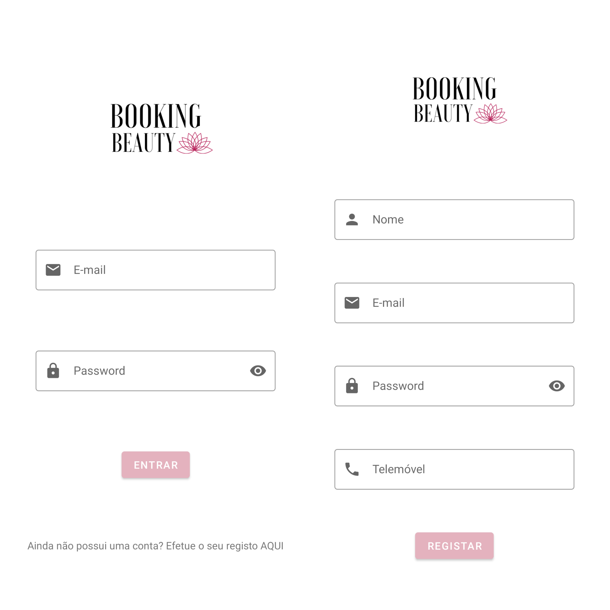
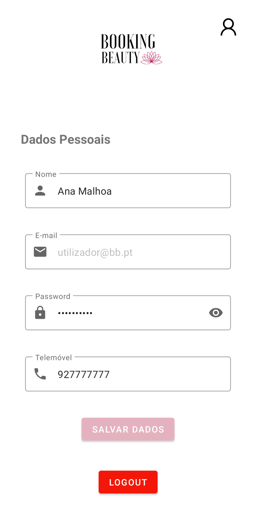
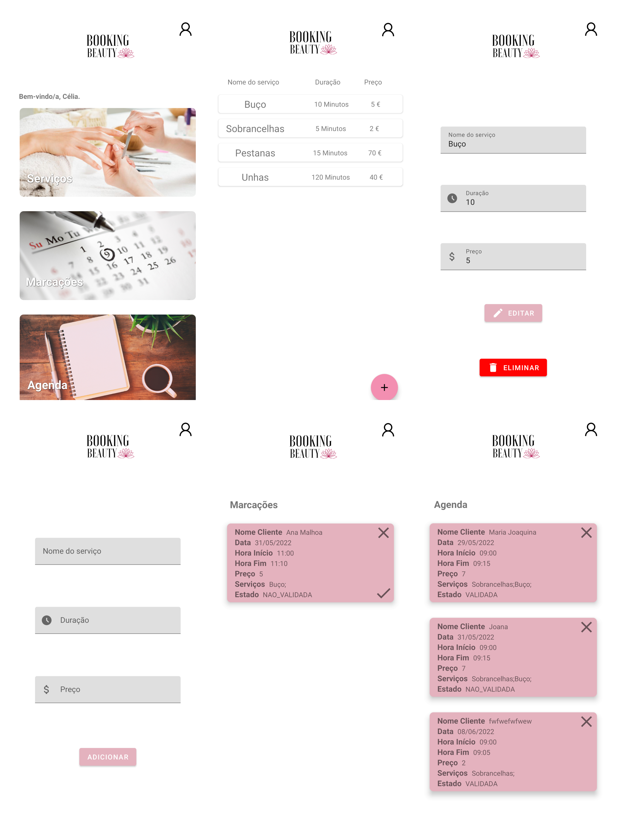
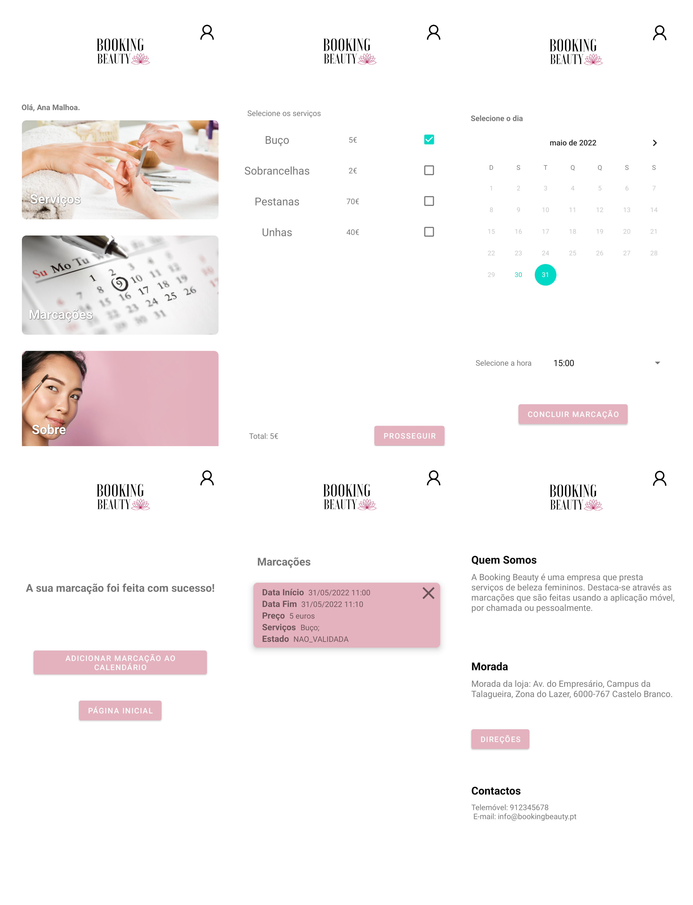

# BookingBeauty

Uma aplicação para realização de marcações num salão de beleza.

---

## Contexto

Aplicação desenvolvida para a componente prática da Unidade Curricular de Informática Móvel lecionada pelo professor José Cruz.
Grupo: Gonçalo Martins, Tiago Fortuna e Vitor Aleluia.

---

## Funcionalidades

- Cliente

  - Realizar marções
  - Cancelar marcações
  - Verificar os serviços prestados
  - Adicionar marcação ao calendário pessoal (i.e, Google Calendar)
  - Ver marcações

- Esteticista
  - Adicionar serviçoes prestados
  - Ver marcações para aprovação
  - Ver agenda das marcações aprovadas
  - Atender marcações
  - Desmarcar marcações

---

## Tecnologias utilizadas

- Android Studio (Java)
- Firebase (Atenticação e Armazenamento)

---

## Screenshots da aplicação

### Interface comum aos dois utilizadores

#### Registo e Login

#### Editar dados pessoais

### Interface da Esteticista

### Interface do Cliente

---

## Divisão das tarefas

- Cliente

  - Ver/Selecionar Serviços (Vitor)
  - Realizar marcação (Vitor)
  - Ver marcações (Gonçalo)
  - Sobre (Tiago)

- Esteticista
  - Adicionar Serviço (Vitor)
  - Marcações (Gonçalo)
  - Agenda (Gonçalo)
  - Login/Registo (Tiago, Refactor: Vitor)
  - Alterar Dados (Gonçalo)
